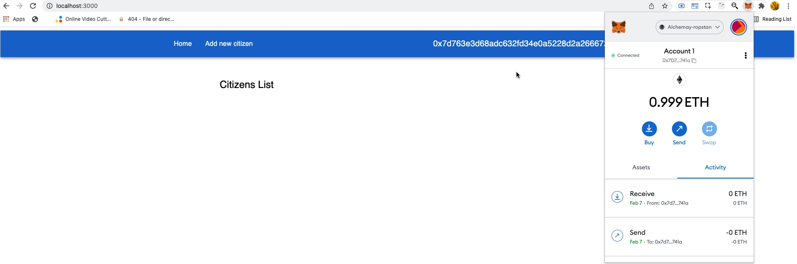

# Citizens App (web3-react-redux)
React application based on smart contract using web3 and MetaMask extention.
 
 


## Start the applicarion
Recomend to install MetaMask extention and create ethereum wallet before starting the application.
https://metamask.io/

```sh
## Install dependencies
yarn install

# Build the application
yarn build

# Format with prettier
yarn format
```
## Artifacts that can be useful.

Smart contract ABI file: 
https://gist.github.com/IhorYermakovSecurrency/6b246d769154b145d730b98b5b61e883 

Smart contract sorce code: 
https://gist.github.com/IhorYermakovSecurrency/651202f46b90be531e95bca2b41d7571 

Deployed smart contract (ropsten testnet): 
https://ropsten.etherscan.io/address/0x7D763E3d68adC632fD34e0a5228D2a266672741a

To be able to write some data to the smart contract, you need test ether.
You can get it from the metamask faucet:
https://faucet.dimensions.network/
